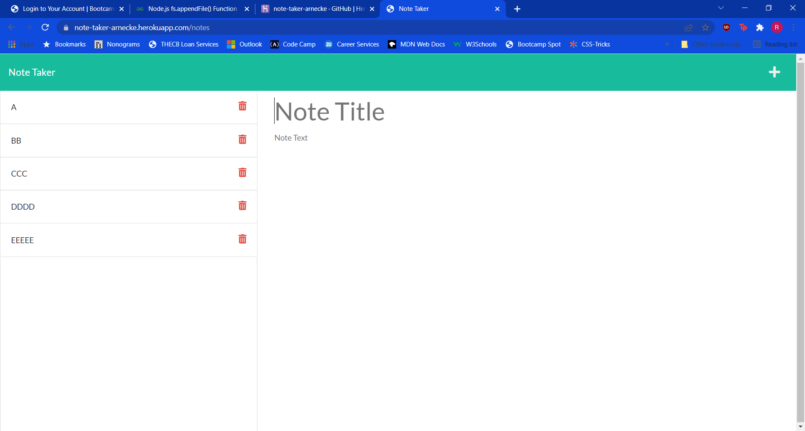

# Note Taker 
    
Title: Note Taker    
Developer: Robyn Arnecke    
Deployed: https://note-taker-arnecke.herokuapp.com/

---

## Summary

Note Taker is a simple application that allows the user to add notes with a title and text body to an API that will keep track of their previous notes. Above is a picture of the application with a few example notes loaded into the API. 

---

## Development

The front end of this application was provided for us. I started out development making sure that the HTML routes housed in the server.js file were functional, before they ever connected to the API file. Once '/notes' route sent the user to the specific notes.html file and all the other routes were sent to the homepage, I worked on the API routing within a specific routes folder. The user is now able to both GET and POST to the API file. 